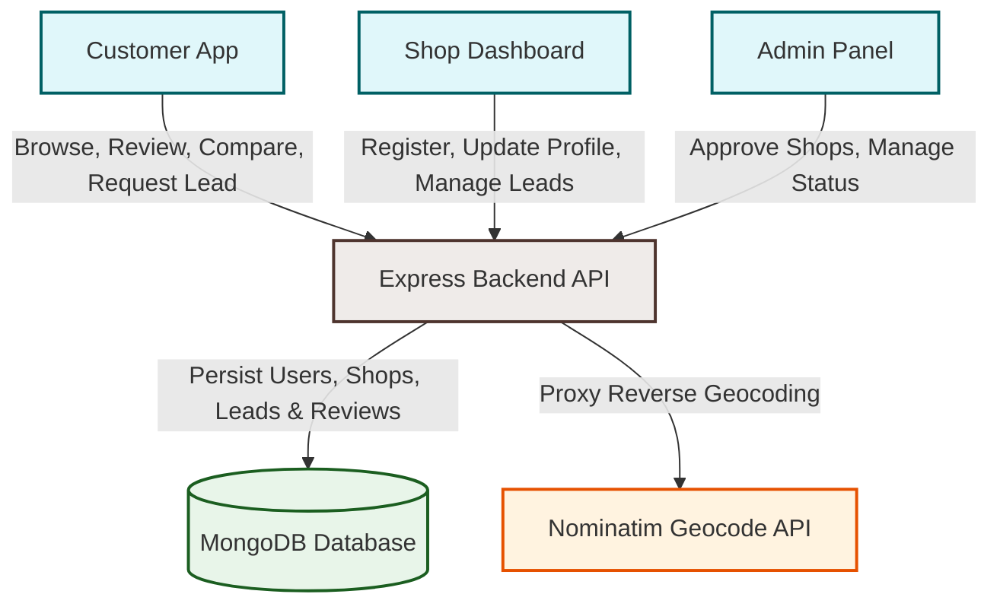

# 🛠️ ProFix - On-Demand Home Services Platform

ProFix is a premium on-demand home services marketplace built using the **MERN (MongoDB, Express.js, React, Node.js)** stack. It connects customers in need of urgent home repairs (AC repair, plumbing, geyser maintenance, electrical, carpentry, painting, cleaning, and pest control) with verified nearby service providers and shops. 

Featuring interactive map-based location picking, reverse geocoding, real-time comparisons, reviews, and a robust admin approval dashboard, ProFix offers an end-to-end workflow for both service seekers and local service businesses.

---

## 🏗️ System Architecture

The following diagram illustrates the interaction flow between the Customer, Service Provider (Shop), Admin, and external APIs (OpenStreetMap/Nominatim):



---

## ✨ Core Features

### 👤 For Customers
*   **Intelligent Geo-Search:** Search and locate verified service providers based on distance using MongoDB 2D-Sphere geo-spatial indices.
*   **Interactive Location Picker:** Choose an exact home address pin on an interactive map.
*   **Comparison Engine:** Select and compare up to three service providers side-by-side on pricing, service list, distance, and rating.
*   **Lead Generation:** Instantly request a service. The platform captures location, details, and message to dispatch to the provider.
*   **Ratings & Reviews:** Write feedback and rate service providers after work completion.

### 🏢 For Shops & Service Providers
*   **Easy Registration:** Custom sign-up flow specifying business details, services offered, and WhatsApp number.
*   **Rich Profile Management:** Upload shop profile picture and showcase gallery images of previous work.
*   **Live Coordinates Pinning:** Select precise coordinates on a map to enable nearby search matching.
*   **Leads Dashboard:** Real-time visibility of client service requests, contact info, and current lead status (New, Contacted, Completed, Cancelled).
*   **Reviews Moderation:** View feedback and monitor overall ratings.

### 🛡️ For Administrators
*   **Verification System:** Gatekeeper control to approve or decline newly registered shops before they go live on the customer map.
*   **Global Overview:** Monitor and edit shop status (active/inactive) and user records.
*   **Admin Seeding Script:** Easily bootstrap the first admin account using environment parameters.

---

## 💻 Tech Stack

| Component | Technology | Description |
| :--- | :--- | :--- |
| **Frontend** | React 18 & Vite | Fast client-side rendering and module bundling |
| **Routing** | React Router DOM v6 | Clean client-side navigation |
| **Animations** | GSAP (GreenSock) | Smooth, premium micro-interactions and transitions |
| **Icons** | Lucide React | Clean, scalable vector iconography |
| **Toasts** | Sonner | Interactive action notification system |
| **SEO** | React Helmet Async | Dynamic HTML head and OpenGraph meta tag updates |
| **Backend** | Node.js & Express.js | Robust REST API endpoints & proxy utilities |
| **Database** | MongoDB & Mongoose | Geospatial querying (2dsphere index) & document schema model |
| **Auth** | JSON Web Tokens & bcryptjs | Secure JWT session management and password hashing |
| **Uploads** | Multer | Multipart form-data handling for server-stored media |

---

## 📂 Project Directory Structure

```text
pro-fix-mern/
├── backend/
│   ├── middleware/        # Authentication & file-upload middlewares
│   ├── models/            # Mongoose Schemas (User, Shop, Lead, Review)
│   ├── routes/            # Express API Routes (auth, shop, user)
│   ├── uploads/           # Uploaded images (profile images & gallery)
│   ├── .env.example       # Example backend variables configuration
│   ├── seed-admin.js      # Script to seed first Admin user
│   └── server.js          # API main entrypoint
├── frontend/
│   ├── src/
│   │   ├── components/    # Reusable components (Navbar, ShopCard, MapPicker, etc.)
│   │   ├── context/       # Auth and Global contexts
│   │   ├── pages/         # Page components (Home, FindServices, Dashboard, etc.)
│   │   ├── App.jsx        # Routing configuration and layout setup
│   │   └── main.jsx       # Client entrypoint
│   ├── .env.example       # Example frontend variables configuration
│   └── vite.config.js     # Vite configuration
└── README.md              # This documentation
```

---

## 🚀 Getting Started

### 📋 Prerequisites
Make sure you have the following installed:
*   [Node.js](https://nodejs.org/) (v16+ recommended)
*   [MongoDB](https://www.mongodb.com/) (Local Community Server or Atlas URI)

---

### 🔧 1. Backend Setup

1.  Navigate to the backend folder:
    ```bash
    cd backend
    ```
2.  Install dependencies:
    ```bash
    npm install
    ```
3.  Configure environment variables:
    Copy the `.env.example` file to `.env` and fill in the values:
    ```bash
    cp .env.example .env
    ```
    Edit `.env`:
    ```env
    MONGODB_URI=<YOUR MONGODB URI>
    PORT=5000
    JWT_SECRET=your_jwt_secret_key_here
    ADMIN_KEY=your_admin_key_here
    ADMIN_EMAIL=<ADD ADMIN EMAIL HERE>
    ADMIN_PASSWORD=<ADD  THE PASSWORD HERE>
    ```
4.  *(Optional)* **Seed Admin User:**
    Bootstrap the first admin credentials configured in your `.env`:
    ```bash
    node seed-admin.js
    ```
5.  Start the development server:
    ```bash
    npm run dev
    ```
    The backend should be running on `http://localhost:5000`.

---

### 🎨 2. Frontend Setup

1.  Navigate to the frontend folder:
    ```bash
    cd ../frontend
    ```
2.  Install dependencies:
    ```bash
    npm install
    ```
3.  Configure environment variables:
    Copy the `.env.example` file to `.env`:
    ```bash
    cp .env.example .env
    ```
    Edit `.env` to point to the backend URL:
    ```env
    VITE_API_URL=http://localhost:5000
    ```
4.  Start the development server:
    ```bash
    npm run dev
    ```
    Open your browser and navigate to `http://localhost:5173`.

---

## 🌐 API Endpoints

### 🔐 Authentication (`/api/auth`)
*   `POST /api/auth/register-customer` - Register a standard client.
*   `POST /api/auth/register-shop` - Register a new service shop.
*   `POST /api/auth/login-user` - Login standard users (Customers/Admins).
*   `POST /api/auth/login-shop` - Login shop account.
*   `GET /api/auth/validate-token` - Validate current session header.

### 🏪 Shops (`/api/shops`)
*   `GET /api/shops` - Retrieve all approved and active shops.
*   `GET /api/shops/nearby` - Get nearby shops using coordinates (`lat`, `lon`, `service`, `maxDistance`).
*   `PUT /api/shops/profile` - Update shop info (requires shop JWT).
*   `POST /api/shops/upload-images` - Upload profile image and gallery (uses Multer).
*   `POST /api/shops/:id/reviews` - Submit a review.
*   `GET /api/shops/admin/pending` - List all unapproved shops (requires admin JWT).
*   `PATCH /api/shops/:id/approve` - Approve a shop (requires admin JWT).
*   `PATCH /api/shops/:id/toggle-active` - Enable/Disable shop status (requires admin JWT).

### 👥 Users & Leads (`/api/users` & `/api/contact`)
*   `GET /api/users/profile` - Get authenticated profile details.
*   `GET /api/users/leads` - Get leads for the authenticated shop or customer user.
*   `POST /api/contact` - Dispatch a direct/shop service request lead.
*   `GET /api/geocode/reverse` - Proxy service to parse address details from coordinates.

---

## 🤝 Contributing
Contributions are welcome! Please open an issue or submit a pull request if you want to suggest improvements or add new features.
